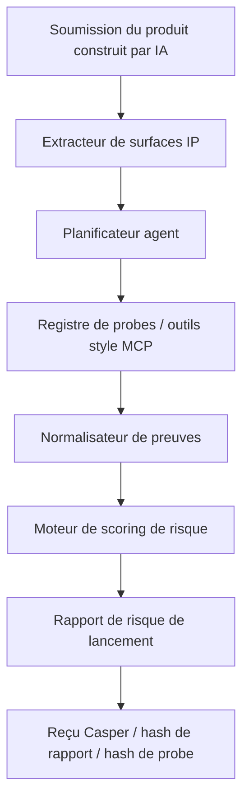
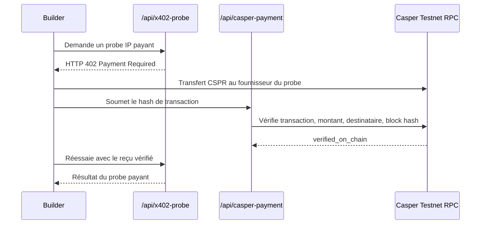

<div align="center">

# 🛡️ IP Breaker

### Pare-feu IP agentique pour produits vibe-coded

[English](README.md) · **Français**

**Faites attaquer votre produit construit par IA avant son lancement.**  
**Probes IP payants. Reçus vérifiés sur Casper. Intelligence de risque de lancement pour l’économie des agents.**

[](https://ip-breaker-web.vercel.app/)
[](https://ip-breaker-web.vercel.app/agent)
[](https://ip-breaker-web.vercel.app/probes)
[](https://www.youtube.com/watch?v=ea7GjoQM6Ig)
[](https://dorahacks.io/buidl/45903)


</div>

---

## ⚡ Thèse en une phrase

**IP Breaker est un moteur de risque IP fondé sur des éléments vérifiables pour les produits construits par IA.**  
Il combine **orchestration agentique de probes**, **accès payant de type x402**, **vérification de transactions sur Casper Testnet**, et un **modèle de rapport de risque prêt pour l’attestation on-chain**.

> Ce n’est **pas** un robot d’avis juridique.  
> C’est un **pare-feu IP pré-lancement** et un prototype de **marché de probes payants** pour l’économie des agents.

---

## 🧾 Snapshot infrastructure

| Signal | MVP actuel |
|---|---|
| **Thèse buildathon** | Infrastructure de risque IP pour l’économie des agents |
| **Produit central** | Pare-feu IP agentique pour produits construits par IA / vibe-coded |
| **Utilisateur cible** | Builders lançant des produits générés par IA avant lancement, levée de fonds ou demo day |
| **Workflow agent** | Extraction des surfaces → planification des probes → normalisation des preuves → rapport de risque |
| **Modèle d’accès payant** | Probes payants de type HTTP 402 / x402-style |
| **Rail de paiement** | Vérification de hash de transaction Casper Testnet |
| **Sortie du moteur de risque** | Launch Risk Score + verdict + constats fondés sur des preuves |
| **Narratif on-chain** | Reçu de paiement, hash de rapport, hash de probe, future attestation de risque |
| **Cas de démo** | AirBoard, un SaaS fictif de tableau blanc IA |
| **Score actuel** | `77 / 100` |
| **Verdict actuel** | `MODIFY BEFORE LAUNCH` |

---

## 🧠 Pourquoi c’est important

Le vibe coding réduit fortement le coût de construction d’un produit, mais il ne supprime **pas** le risque de propriété intellectuelle.

Les produits construits par IA peuvent encore être lancés avec :

- des dépendances copiées ou contaminées par des licences,
- des noms de produits ou logos risqués,
- des interfaces proches de produits existants,
- des signaux incertains sur l’origine du code,
- des ensembles de fonctionnalités pouvant justifier une revue brevet / FTO.

**IP Breaker traite le risque IP comme une surface d’attaque de lancement.**

Au lieu d’agir comme un chatbot juridique générique, il se comporte comme un **moteur de risque agentique** :

- il extrait les surfaces de risque IP,
- sélectionne les probes à exécuter,
- collecte des constats fondés sur des preuves,
- calcule un score de risque de lancement,
- retourne des signaux de revue humaine,
- et prépare le résultat pour des reçus Casper et de futures attestations.

---

## 🔗 Carte de démo live

| Ressource | Lien |
|---|---|
| 🚀 Démo live | https://ip-breaker-web.vercel.app/ |
| 🧠 Workflow agent fondé sur les preuves | https://ip-breaker-web.vercel.app/agent |
| 💳 Probe payant vérifié par Casper | https://ip-breaker-web.vercel.app/probes |
| 📄 Rapport de risque de lancement | https://ip-breaker-web.vercel.app/report |
| 🧪 Probe de contamination de licence | https://ip-breaker-web.vercel.app/license |
| 🔌 Sortie JSON de l’agent | https://ip-breaker-web.vercel.app/api/agent-run |
| 🎬 Vidéo de démonstration | https://www.youtube.com/watch?v=ea7GjoQM6Ig |
| 🏗️ DoraHacks BUIDL | https://dorahacks.io/buidl/45903 |
| 💻 GitHub | https://github.com/StuartCHAN/ip-breaker |

---

## ✨ Ce que les juges devraient remarquer

| Signal buildathon | Ce qui fonctionne déjà |
|---|---|
| **Workflow agentique** | `/agent` montre l’extraction des surfaces IP, la planification des probes, les constats fondés sur des preuves, le scoring et la rédaction du rapport. |
| **Probe de risque opérationnel** | `/license` exécute un classificateur local de licences sur les métadonnées de dépendances. |
| **Modèle d’outil payant** | `/probes` retourne HTTP 402 avant paiement et ne renvoie le résultat qu’après vérification Casper. |
| **Intégration Casper** | Le backend vérifie le succès de transaction, le montant, le compte destinataire et le block hash via Casper Testnet JSON-RPC. |
| **Primitive de type finance** | Des probes IP spécialisés fonctionnent comme des endpoints d’intelligence payants appelables par des agents. |
| **Conception prête pour attestation** | Les fichiers produit restent off-chain ; les hashes, reçus et métadonnées minimales peuvent être attestés. |
| **Positionnement IP clair** | IP Breaker est un pare-feu IP d’infrastructure, pas une application de questions-réponses juridiques. |

---

## 🏗️ Thèse système



<div align="center">

**IP Breaker = Moteur de risque IP + Marché de probes payants + Couche de reçus vérifiés par Casper**

</div>

---

## 💳 Flux de probe payant vérifié par Casper

Le MVP démontre un vrai **flux de probe payant adossé à Casper** :



Champs de paiement vérifiés retournés par le MVP live :

```text
status: verified_on_chain
mode: casper-testnet-paid-probe
amount: 2.5 CSPR
rpcMethod: info_get_transaction/object-params-version1
```

Cela rapproche IP Breaker d’une **infrastructure pour l’économie des agents** plutôt que d’un simple outil SaaS de conformité.

---

## 🧬 Agent IP fondé sur les preuves

La route `/agent` démontre le motif principal de l’agent IA :

1. Extraire les surfaces de risque IP depuis les métadonnées produit.
2. Planifier les probes à exécuter.
3. Exécuter des probes qui produisent des éléments de preuve.
4. Normaliser les constats dans un schéma cohérent.
5. Calculer un score de risque de lancement et générer un rapport avec signaux de revue humaine.

Plan actuel des probes pour AirBoard :

| Probe | Rôle actuel |
|---|---|
| **License Contamination Probe** | Vérifie les métadonnées de packages et les signaux de licences de dépendances. |
| **Trademark Collision Probe** | Génère des signaux de risque de nom et des termes de recherche type WIPO / USPTO / EUIPO. |
| **Design Lookalike Probe** | Signale les risques d’interface ou de logo trop proches de modèles existants. |
| **Patent Claim Trap Probe** | Extrait des clusters de fonctionnalités proches de revendications et des requêtes de recherche brevet. |

Exemple de sortie structurée :

```json
{
  "mode": "evidence-backed-ip-agent",
  "product": "AirBoard",
  "riskScore": 77,
  "verdict": "MODIFY BEFORE LAUNCH",
  "selectedProbes": [
    "license-contamination-probe",
    "trademark-collision-probe",
    "design-lookalike-probe",
    "patent-claim-trap-probe"
  ]
}
```

---

## 📸 Captures d’écran

| Pare-feu IP agentique | Soumission du produit |
|---|---|
|  |  |
| IP Breaker présente le risque IP comme une surface d’attaque pré-lancement. | Les builders soumettent dépôt, nom, marché cible, capture UI et description technique. |

| Rapport de risque de lancement | Probe payant vérifié par Casper |
|---|---|
|  |  |
| Score de risque, verdict, constats, hashes et métadonnées d’attestation Casper. | HTTP 402, vérification de transaction Casper Testnet, block hash et résultat du probe payant. |

---

## 🧭 Carte de démo

| Page | Ce qu’elle montre |
|---|---|
| `/` | Positionnement produit et points d’entrée. |
| `/agent` | Workflow agent IP : extraction de surfaces → planner → probes → rapport. |
| `/submit` | Formulaire de soumission AirBoard. |
| `/report` | Score de risque et constats IP structurés. |
| `/license` | Probe de contamination de licence opérationnel. |
| `/probes` | Flux de probe payant x402-style avec vérification Casper Testnet. |
| `/api/agent-run` | Workflow agent structuré en JSON. |
| `/api/casper-payment` | Exigences de paiement et endpoint de vérification Casper. |

---

## 🧪 Cas de démonstration AirBoard

Le MVP utilise **AirBoard**, une application fictive de tableau blanc collaboratif IA.

Le builder souhaite lancer AirBoard publiquement. IP Breaker examine le nom du produit, le motif UI, les métadonnées de packages et la description technique. Le rapport de démonstration identifie plusieurs signaux de risque pré-lancement :

- **HIGH** — risque possible de collision de nom dans les marchés SaaS / logiciel.
- **HIGH** — revue nécessaire de dépendances GPL / AGPL.
- **MEDIUM** — risque d’interface ressemblant à des tableaux de bord collaboratifs courants.
- **MEDIUM** — clusters techniques pouvant justifier une revue brevet / FTO.

---

## 🏗️ Implémentation actuelle

### Application web

La démo web est construite avec **Next.js** et déployée sur Vercel.

| Route | Description |
|---|---|
| `/` | Page d’accueil. |
| `/agent` | Démo du workflow agent IP fondé sur des preuves. |
| `/submit` | Démo de soumission du produit AirBoard. |
| `/report` | Tableau de bord du Launch Risk Report. |
| `/license` | Page du License Contamination Probe. |
| `/probes` | Flux de probe payant avec vérification de hash de transaction Casper Testnet. |
| `/api/agent-run` | JSON structuré du workflow agent et du rapport. |
| `/api/scan` | API mock de rapport complet de risque IP. |
| `/api/license-probe` | API du probe de licence. |
| `/api/casper-payment` | API de vérification de paiement Casper Testnet. |
| `/api/x402-probe` | API de probe payant retournant HTTP 402 avant vérification. |

### Structure du dépôt

```text
apps/web/              Démo cliquable Next.js
apps/web/app/          Pages et routes API
apps/web/lib/          Données mock, logique de licence, workflow agent IP, vérificateur Casper
docs/                  Architecture, flux de démo, disclaimer, roadmap, résumé de soumission
```

---

## 🧰 Développement local

```bash
npm install
npm run dev:web
```

Puis ouvrir :

```text
http://localhost:3000
```

Build :

```bash
npm run build:web
```

Endpoints utiles :

```text
http://localhost:3000/api/agent-run
http://localhost:3000/api/license-probe
http://localhost:3000/api/casper-payment
http://localhost:3000/api/x402-probe
```

---

## 🔐 Confidentialité et modèle d’attestation

Le modèle d’attestation orienté Casper ne stocke que des métadonnées minimales :

```text
work_hash
report_hash
risk_score
verdict
issue_codes
scanner_agent_id
created_at
```

Le registre ne stocke **pas** le code source brut, les fichiers privés, les captures d’écran, les secrets commerciaux ou les conclusions juridiques.

---

## ⚠️ Avertissement

IP Breaker ne fournit **pas** d’avis juridique, de conseil juridique, d’opinion d’infraction, d’opinion de validité, d’avis de clearance ou d’opinion formelle de liberté d’exploitation.

Il effectue un triage de risque IP pré-lancement dans un style red-team. Les constats à risque élevé doivent être revus par un conseil qualifié en propriété intellectuelle avant lancement, levée de fonds, investissement ou déploiement commercial.

---

## ✅ Statut

Ce projet a complété un premier MVP cliquable pour le **Casper Agentic Buildathon 2026 Qualification Round**.

- [x] Page d’accueil et formulaire de soumission
- [x] Page de workflow agent IP fondé sur les preuves
- [x] Flux produit AirBoard
- [x] Launch Risk Report
- [x] Classificateur local de risque de licence
- [x] Flux de probe payant x402-style
- [x] Vérificateur de hash de transaction Casper Testnet
- [x] Placeholder d’attestation Casper
- [x] Déploiement public Vercel
- [x] Vidéo de démonstration
- [x] Soumission DoraHacks BUIDL

---

## 🛣️ Roadmap

- [ ] Connecter des probes live pour marques, brevets et dessins/modèles.
- [ ] Ajouter de vrais wrappers MCP pour les probes IP externes.
- [ ] Ajouter une initiation de paiement Casper native dans l’application.
- [ ] Déployer un registre minimal d’attestation Casper Testnet.
- [ ] Remplacer le deploy hash placeholder par une vraie transaction Casper Testnet.
- [ ] Ajouter l’ingestion de vrais dépôts GitHub.
- [ ] Ajouter export de rapport et pages de vérification d’attestation partageables.

---

<div align="center">

**L’IA accélère la création de produits. IP Breaker les rend plus sûrs à lancer.**

</div>
