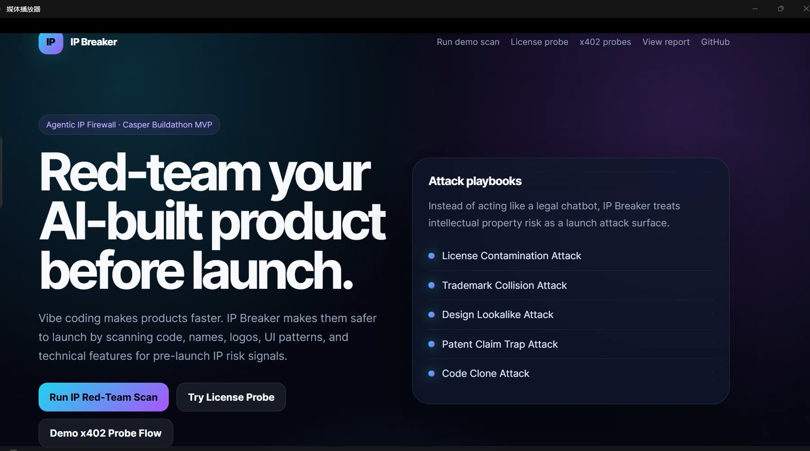
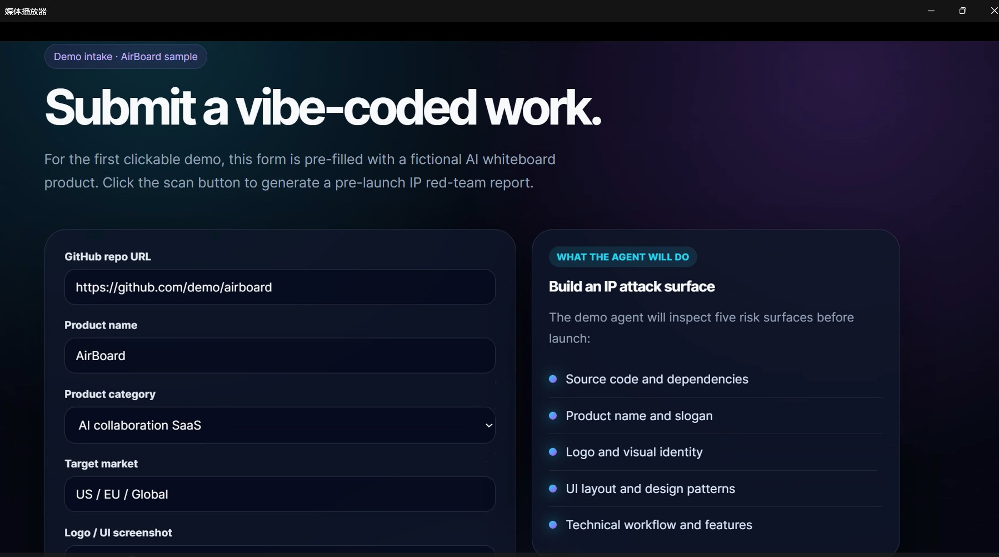
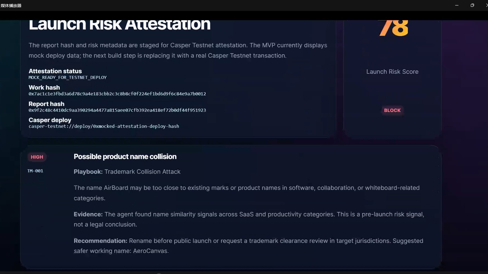
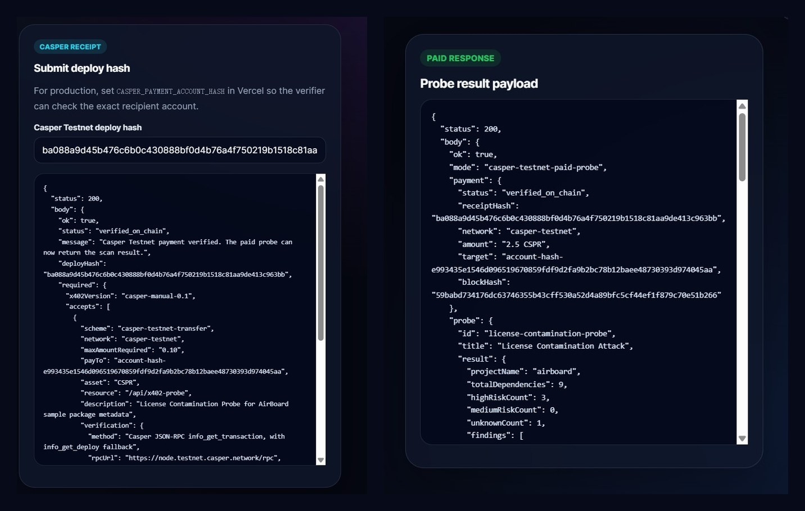

# IP Breaker

**Agentic IP Firewall for Vibe-Coded Products**

> Before your AI-built product goes live, let an IP agent attack it first.

[](https://ip-breaker-web.vercel.app/)
[](https://www.youtube.com/watch?v=ea7GjoQM6Ig)
[](https://dorahacks.io/buidl/45903)

## Live Links

- **Live demo:** https://ip-breaker-web.vercel.app/
- **Demo video:** https://www.youtube.com/watch?v=ea7GjoQM6Ig
- **DoraHacks BUIDL:** https://dorahacks.io/buidl/45903
- **GitHub:** https://github.com/StuartCHAN/ip-breaker

## Screenshots

| Agentic IP Firewall                                                             | Product Submission                                                                           |
| ------------------------------------------------------------------------------- | -------------------------------------------------------------------------------------------- |
|                  |                         |
| IP Breaker frames IP risk as a pre-launch attack surface for AI-built products. | Builders submit repo, product name, target market, UI screenshot, and technical description. |

| Launch Risk Report                                                                                | x402-Style Paid Probe                                                                               |
| ------------------------------------------------------------------------------------------------- | --------------------------------------------------------------------------------------------------- |
|                           |                       |
| The report shows risk score, verdict, findings, hashes, and Casper-oriented attestation metadata. | The paid probe flow demonstrates HTTP 402, Casper Testnet deploy-hash verification, scan result, and probe receipt hash. |


## Built For

**Casper Agentic Buildathon 2026 Qualification Round**

IP Breaker is built as an AI-agent and developer tooling project for the emerging agent economy. It combines pre-launch intellectual property risk triage, agent-style probe orchestration, an x402-style paid probe flow, Casper Testnet deploy-hash payment verification, and Casper-oriented launch-risk attestation.

## Problem

Vibe coding tools make it possible to build and launch products in hours. However, many AI-built products are shipped without checking whether the generated work creates intellectual property risk.

A product may include license-contaminated code, copied code patterns, confusingly similar names or logos, UI/design lookalikes, or technical features that require patent or freedom-to-operate review before public launch.

IP Breaker treats intellectual property risk as a **pre-launch attack surface**.

## Solution

IP Breaker is a red-team agent for AI-built products. A builder submits a GitHub repo, product name, logo or UI screenshot, target market, and technical description. The agent decomposes the product into IP risk surfaces and runs multiple review playbooks:

- **License Contamination Attack** — reviews package metadata and dependency license signals.
- **Code Clone Attack** — identifies possible copied-code or public-code similarity risk signals.
- **Trademark Collision Attack** — checks whether the product name, logo, or slogan may collide with existing brands.
- **Design Lookalike Attack** — reviews UI or visual similarity risk signals.
- **Patent Claim Trap Attack** — decomposes technical workflows into features that may require patent/FTO review.

The output is a **Launch Risk Score**, concrete findings, recommended actions, and a report hash prepared for Casper Testnet attestation.

## MVP Demo

The public demo uses a fictional vibe-coded product called **AirBoard**, an AI whiteboard collaboration app.

The builder wants to launch AirBoard publicly. IP Breaker reviews the product name, UI pattern, package metadata, and technical description. The demo report identifies several pre-launch risk signals:

- A possible product-name collision in SaaS/software categories.
- A UI lookalike risk against known collaboration product patterns.
- A copyleft dependency review issue in the dependency chain.
- Patent claim-trap clusters that may require freedom-to-operate review.

The demo includes:

- A clickable product submission flow.
- A Launch Risk Report with a risk score and findings.
- A working local **License Contamination Probe**.
- An **x402-style paid probe flow** showing HTTP 402 and Casper Testnet deploy-hash verification.
- A Casper Testnet attestation placeholder showing work hash, report hash, and deploy metadata.

## Why Casper

IP Breaker is designed for the agent economy.

- AI agents can use MCP-style tools to call specialized IP risk probes.
- x402-style paid probes allow agents to pay per scan or per data source.
- Casper Testnet deploy hashes can be used as payment receipts before a paid probe returns results.
- Casper Testnet can anchor launch-risk attestations, report hashes, issue codes, and scanner agent identity.
- Only hashes and minimal risk metadata are written on-chain. Raw source code, screenshots, product files, and business secrets stay off-chain.

## Architecture

```text
User Work Submission
        |
        v
IP Red-Team Agent
        |
        +--> License Probe
        +--> Trademark Probe
        +--> Patent Probe
        +--> Design Probe
        +--> Code Clone Probe
        |
        v
Launch Risk Report
        |
        v
Casper Risk Attestation Registry
```

## On-chain Attestation Model

The Casper-oriented attestation stores only minimal metadata:

```text
work_hash
report_hash
risk_score
verdict
issue_codes
scanner_agent_id
created_at
```

The registry does **not** store raw source code, private files, screenshots, business secrets, or legal conclusions.

## Current Implementation

### Web App

The demo web app is built with **Next.js** and deployed on Vercel.

Routes:

- `/` — landing page
- `/submit` — AirBoard product submission demo
- `/report` — Launch Risk Report dashboard
- `/license` — working License Contamination Probe page
- `/probes` — x402-style paid probe flow with Casper Testnet deploy-hash verification
- `/api/scan` — mock full IP risk report API
- `/api/license-probe` — license probe API
- `/api/casper-payment` — Casper Testnet deploy-hash payment verification API
- `/api/x402-probe` — paid probe API returning HTTP 402 before payment verification

### License Probe

The license probe analyzes package metadata and classifies license signals into:

- permissive license signals
- weak-copyleft license signals
- strong-copyleft license signals
- unknown license signals

For the AirBoard sample, GPL and AGPL-style dependencies are flagged before launch.

### x402-style Paid Probe Flow with Casper Payment Verification

The `/probes` page demonstrates a paid probe flow:

1. The first request is made without payment.
2. The API returns `HTTP 402 Payment Required` and Casper Testnet payment requirements.
3. The user or agent transfers the quoted CSPR amount to the configured probe provider account.
4. The user or agent submits the Casper Testnet deploy hash.
5. The backend calls Casper JSON-RPC `info_get_deploy` to verify deploy success, transfer amount, and recipient.
6. The paid probe result is returned only after the deploy hash is verified.

Required environment variables for production verification:

```bash
CASPER_PAYMENT_ACCOUNT_HASH=account-hash-...
CASPER_PAYMENT_AMOUNT_CSPR=0.10
CASPER_RPC_URL=https://node.testnet.casper.network/rpc
CASPER_PAYMENT_NETWORK=casper-testnet
```

This demonstrates how specialized IP probes could become paid agent-callable tools backed by blockchain payment receipts.

### Casper Attestation Placeholder

The report page currently displays a Casper Testnet attestation placeholder. The intended production path is to replace the placeholder deploy hash with a real Casper Testnet transaction that anchors the report hash and minimal risk metadata.

## Local Development

```bash
npm install
npm run dev:web
```

Then open:

```text
http://localhost:3000
```

Build:

```bash
npm run build:web
```

## Repository Structure

```text
apps/web/              Next.js clickable demo
apps/web/app/          Pages and API routes
apps/web/lib/          Mock scan data, license probe logic, Casper payment verifier
docs/                  Architecture, demo flow, disclaimer, roadmap, submission summary
```

## Disclaimer

IP Breaker does **not** provide legal opinions, legal advice, infringement opinions, validity opinions, clearance opinions, or formal freedom-to-operate opinions.

It performs pre-launch IP risk triage and red-team style review. High-risk findings should be reviewed by qualified intellectual property counsel before launch, fundraising, investment, or commercial deployment.

## Status

This project has completed a first clickable MVP for the Casper Agentic Buildathon 2026 Qualification Round.

- [x] Landing page and submission form
- [x] AirBoard sample product flow
- [x] Launch Risk Report
- [x] Working local license-risk classifier
- [x] x402-style paid probe flow
- [x] Casper Testnet deploy-hash payment verifier
- [x] Casper attestation placeholder
- [x] Public Vercel deployment
- [x] Demo video
- [x] DoraHacks BUIDL submission

## Roadmap

- [ ] Connect live trademark, patent, and design search probes.
- [ ] Add real MCP server wrappers for external IP probes.
- [ ] Add wallet-native Casper payment initiation.
- [ ] Deploy a minimal Casper Testnet attestation registry.
- [ ] Replace the placeholder deploy hash with a real Casper Testnet transaction.
- [ ] Add repository-level scan ingestion for real GitHub projects.
- [ ] Add report export and shareable attestation verification pages.
