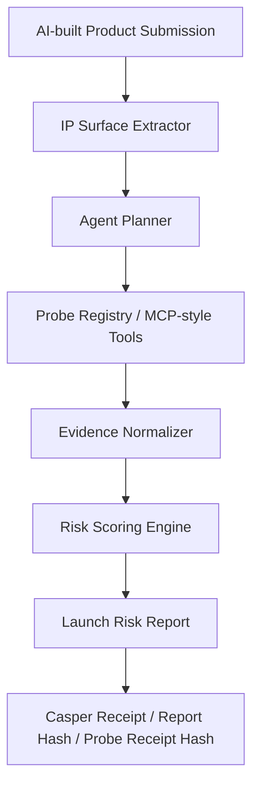
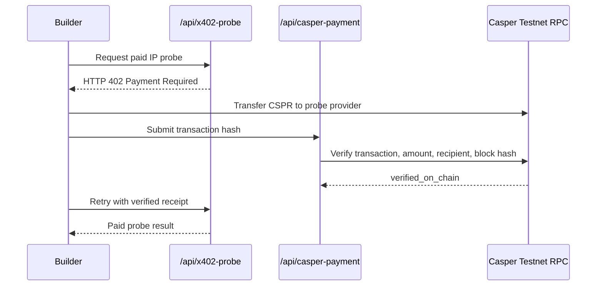

<div align="center">

# 🛡️ IP Breaker

### Agentic IP Firewall for Vibe-Coded Products

**Red-team your AI-built product before launch.**  
**Paid IP probes. Casper-verified receipts. Launch-risk intelligence for the agent economy.**

[](https://ip-breaker-web.vercel.app/)
[](https://ip-breaker-web.vercel.app/agent)
[](https://ip-breaker-web.vercel.app/probes)
[](https://www.youtube.com/watch?v=ea7GjoQM6Ig)
[](https://dorahacks.io/buidl/45903)


</div>

---

## ⚡ One-line thesis

**IP Breaker is an evidence-backed IP risk engine for AI-built products.**  
It combines **agentic probe orchestration**, **x402-style paid tool access**, **Casper Testnet transaction verification**, and an **attestation-ready launch-risk reporting model**.

> This is **not** a legal-opinion bot.  
> It is a **pre-launch IP firewall** and **paid probe market prototype** for the agent economy.

---

## 🧾 Infra Snapshot

| Signal | Current MVP |
|---|---|
| **Buildathon Thesis** | IP Risk Infrastructure for the Agent Economy |
| **Core Product** | Agentic IP Firewall for AI-built / vibe-coded products |
| **Primary User** | Builders shipping AI-generated products before launch, fundraising, or demo day |
| **Agent Workflow** | Surface extraction → probe planning → evidence normalization → launch-risk report |
| **Paid Tool Pattern** | x402-style HTTP 402 paid probes |
| **Payment Rail** | Casper Testnet transaction-hash verification |
| **Risk Engine Output** | Launch Risk Score + verdict + evidence-backed findings |
| **On-chain Story** | Payment receipt, report hash, probe receipt hash, future risk attestation |
| **Demo Case** | AirBoard, a fictional AI whiteboard SaaS |
| **Current Risk Score** | `77 / 100` |
| **Current Verdict** | `MODIFY BEFORE LAUNCH` |

---

## 🧠 Why this matters

Vibe coding dramatically lowers the cost of building products, but it does **not** remove intellectual property risk.

AI-built products may still launch with:

- copied or license-contaminated dependencies,
- risky product names or logos,
- lookalike UI patterns,
- uncertain code-origin signals,
- patent-like technical feature clusters that justify review.

**IP Breaker treats IP risk as a launch attack surface.**

Instead of acting like a generic legal chatbot, it behaves like a structured **agentic risk engine**:

- extracts IP risk surfaces,
- selects which probes should run,
- collects evidence-backed findings,
- scores launch risk,
- returns human-review triggers,
- and prepares the result for Casper-oriented receipts and future attestations.

---

## 🔗 Live Demo Map

| Resource | Link |
|---|---|
| 🚀 Live demo | https://ip-breaker-web.vercel.app/ |
| 🧠 Evidence-backed agent workflow | https://ip-breaker-web.vercel.app/agent |
| 💳 Casper-verified paid probe flow | https://ip-breaker-web.vercel.app/probes |
| 📄 Launch risk report | https://ip-breaker-web.vercel.app/report |
| 🧪 License contamination probe | https://ip-breaker-web.vercel.app/license |
| 🔌 Agent JSON output | https://ip-breaker-web.vercel.app/api/agent-run |
| 🎬 Demo video | https://www.youtube.com/watch?v=ea7GjoQM6Ig |
| 🏗️ DoraHacks BUIDL | https://dorahacks.io/buidl/45903 |
| 💻 GitHub | https://github.com/StuartCHAN/ip-breaker |

---

## ✨ What judges should notice

| Buildathon signal | What is already working |
|---|---|
| **Agentic workflow** | `/agent` shows IP surface extraction, probe planning, evidence-backed findings, risk scoring, and structured report writing. |
| **Working risk probe** | `/license` runs a real local license classifier over package metadata. |
| **Paid tool pattern** | `/probes` returns HTTP 402 before payment and returns results only after Casper verification. |
| **Casper integration** | The backend verifies transaction success, amount, recipient account, and block hash through Casper Testnet JSON-RPC. |
| **Finance-style primitive** | Specialized IP probes behave like paid intelligence endpoints that agents can call per task. |
| **Attestation-ready design** | Raw product files stay off-chain; hashes, receipts, and minimal risk metadata are intended for attestation. |
| **Clear IP positioning** | IP Breaker is an infra-style IP launch firewall, not a generic legal Q&A app. |

---

## 🏗️ System Thesis



<div align="center">

**IP Breaker = IP Risk Engine + Paid Probe Market + Casper-Verified Receipt Layer**

</div>

---

## 💳 Casper-verified paid probe flow

The MVP demonstrates a real **Casper-backed paid probe flow**:



Verified payment fields returned by the live MVP include:

```text
status: verified_on_chain
mode: casper-testnet-paid-probe
amount: 2.5 CSPR
rpcMethod: info_get_transaction/object-params-version1
```

This makes IP Breaker closer to **agent economy infrastructure** than a normal SaaS compliance tool.

---

## 🧬 Evidence-backed IP agent

The `/agent` route demonstrates the main AI-agent pattern:

1. Extract IP risk surfaces from product metadata.
2. Plan which probes should run.
3. Run evidence-producing probes.
4. Normalize findings into a consistent result schema.
5. Score launch risk and write a report with human-review triggers.

Current AirBoard probe plan:

| Probe | Current role |
|---|---|
| **License Contamination Probe** | Checks package metadata and dependency license signals. |
| **Trademark Collision Probe** | Generates name-risk signals and search terms for WIPO / USPTO / EUIPO style review. |
| **Design Lookalike Probe** | Flags crowded UI / logo pattern signals for visual originality review. |
| **Patent Claim Trap Probe** | Extracts claim-like feature clusters and patent search strings. |

Example structured output:

```json
{
  "mode": "evidence-backed-ip-agent",
  "product": "AirBoard",
  "riskScore": 77,
  "verdict": "MODIFY BEFORE LAUNCH",
  "selectedProbes": [
    "license-contamination-probe",
    "trademark-collision-probe",
    "design-lookalike-probe",
    "patent-claim-trap-probe"
  ]
}
```

---

## 📸 Screenshots

| Agentic IP Firewall                                                             | Product Submission                                                                           |
| ------------------------------------------------------------------------------- | -------------------------------------------------------------------------------------------- |
|                  |                         |
| IP Breaker frames IP risk as a pre-launch attack surface for AI-built products. | Builders submit repo, product name, target market, UI screenshot, and technical description. |

| Launch Risk Report                                                                                | Casper-Verified Paid Probe                                                                            |
| ------------------------------------------------------------------------------------------------- | ------------------------------------------------------------------------------------------------------ |
|                           |                        |
| Risk score, verdict, findings, hashes, and Casper-oriented attestation metadata. | HTTP 402, Casper Testnet transaction verification, block hash, and paid probe result. |

---

## 🧭 Demo map

| Page | What it shows |
|---|---|
| `/` | Product positioning and quick entry points. |
| `/agent` | Evidence-backed IP agent workflow: surface extraction → planner → probe calls → report. |
| `/submit` | AirBoard sample product submission. |
| `/report` | Launch Risk Score and structured IP risk findings. |
| `/license` | Working License Contamination Probe. |
| `/probes` | x402-style paid probe flow with Casper Testnet transaction verification. |
| `/api/agent-run` | Structured agent workflow and report JSON. |
| `/api/casper-payment` | Casper payment requirements and verification endpoint. |

---

## 🧪 AirBoard demo case

The MVP demo uses **AirBoard**, a fictional vibe-coded AI whiteboard collaboration app.

The builder wants to launch AirBoard publicly. IP Breaker reviews the product name, UI pattern, package metadata, and technical description. The demo report identifies several pre-launch risk signals:

- **HIGH** — possible product-name collision in SaaS / software markets.
- **HIGH** — GPL / AGPL dependency review issue in the dependency chain.
- **MEDIUM** — UI lookalike risk against common collaboration dashboard patterns.
- **MEDIUM** — patent claim-trap clusters that may require FTO review.

Example agent output:

```json
{
  "mode": "evidence-backed-ip-agent",
  "product": "AirBoard",
  "riskScore": 77,
  "verdict": "MODIFY BEFORE LAUNCH",
  "selectedProbes": [
    "license-contamination-probe",
    "trademark-collision-probe",
    "design-lookalike-probe",
    "patent-claim-trap-probe"
  ]
}
```

---

## 🏗️ Current implementation

### Web app

The demo web app is built with **Next.js** and deployed on Vercel.

| Route | Description |
|---|---|
| `/` | Landing page. |
| `/agent` | Evidence-backed IP agent workflow demo. |
| `/submit` | AirBoard product submission demo. |
| `/report` | Launch Risk Report dashboard. |
| `/license` | Working License Contamination Probe page. |
| `/probes` | x402-style paid probe flow with Casper Testnet transaction-hash verification. |
| `/api/agent-run` | Structured agent workflow and report JSON. |
| `/api/scan` | Mock full IP risk report API. |
| `/api/license-probe` | License probe API. |
| `/api/casper-payment` | Casper Testnet transaction-hash payment verification API. |
| `/api/x402-probe` | Paid probe API returning HTTP 402 before payment verification. |

### Repository structure

```text
apps/web/              Next.js clickable demo
apps/web/app/          Pages and API routes
apps/web/lib/          Mock scan data, license probe logic, IP agent workflow, Casper payment verifier
docs/                  Architecture, demo flow, disclaimer, roadmap, submission summary
```

---

## 🧰 Local development

```bash
npm install
npm run dev:web
```

Then open:

```text
http://localhost:3000
```

Build:

```bash
npm run build:web
```

Useful local checks:

```text
http://localhost:3000/api/agent-run
http://localhost:3000/api/license-probe
http://localhost:3000/api/casper-payment
http://localhost:3000/api/x402-probe
```

---

## 🔐 Privacy and attestation model

The Casper-oriented attestation model stores only minimal metadata:

```text
work_hash
report_hash
risk_score
verdict
issue_codes
scanner_agent_id
created_at
```

The registry does **not** store raw source code, private files, screenshots, business secrets, or legal conclusions.

---

## ⚠️ Disclaimer

IP Breaker does **not** provide legal opinions, legal advice, infringement opinions, validity opinions, clearance opinions, or formal freedom-to-operate opinions.

It performs pre-launch IP risk triage and red-team style review. High-risk findings should be reviewed by qualified intellectual property counsel before launch, fundraising, investment, or commercial deployment.

---

## ✅ Status

This project has completed a first clickable MVP for the **Casper Agentic Buildathon 2026 Qualification Round**.

- [x] Landing page and submission form
- [x] Evidence-backed IP agent workflow page
- [x] AirBoard sample product flow
- [x] Launch Risk Report
- [x] Working local license-risk classifier
- [x] x402-style paid probe flow
- [x] Casper Testnet transaction-hash payment verifier
- [x] Casper attestation placeholder
- [x] Public Vercel deployment
- [x] Demo video
- [x] DoraHacks BUIDL submission

---

## 🛣️ Roadmap

- [ ] Connect live trademark, patent, and design search probes.
- [ ] Add real MCP server wrappers for external IP probes.
- [ ] Add wallet-native Casper payment initiation.
- [ ] Deploy a minimal Casper Testnet attestation registry.
- [ ] Replace the placeholder deploy hash with a real Casper Testnet transaction.
- [ ] Add repository-level scan ingestion for real GitHub projects.
- [ ] Add report export and shareable attestation verification pages.

---

<div align="center">

**AI makes products faster. IP Breaker makes them safer to launch.**

</div>
