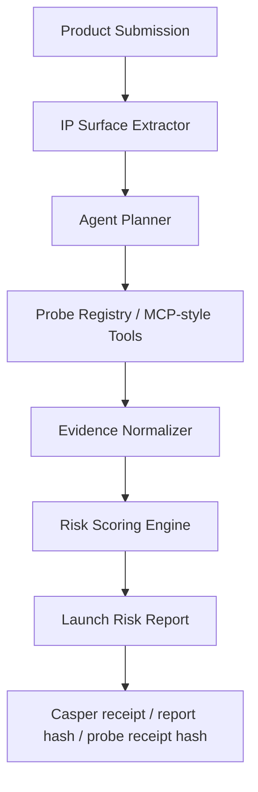
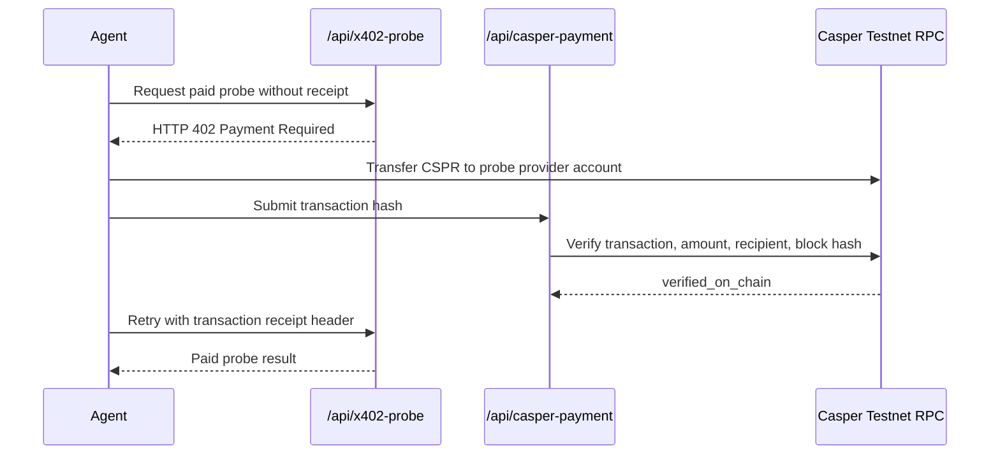

<div align="center">

# 🛡️ IP Breaker

### Agentic IP Firewall for Vibe-Coded Products

**Before your AI-built product goes live, let an IP agent attack it first.**

[](https://ip-breaker-web.vercel.app/)
[](https://www.youtube.com/watch?v=ea7GjoQM6Ig)
[](https://dorahacks.io/buidl/45903)
[](#casper-testnet-payment-verification)


</div>

---

## ⚡ The 15-second pitch

**IP Breaker is an evidence-backed IP risk agent for AI-built products.**

Vibe coding helps builders ship fast, but it also creates a new launch risk surface: generated code, open-source dependencies, product names, UI lookalikes, logos, and patent-like technical workflows. IP Breaker decomposes a submitted product into IP risk surfaces, plans which probes to run, normalizes evidence, generates a Launch Risk Score, and can unlock paid probes through Casper Testnet transaction verification.

> IP Breaker does **not** claim to provide infringement, clearance, validity, or FTO opinions. It provides pre-launch IP risk triage for builders.

---

## 🔗 Live links

| Resource | Link |
|---|---|
| 🚀 Live demo | https://ip-breaker-web.vercel.app/ |
| 🧠 Agent workflow | https://ip-breaker-web.vercel.app/agent |
| 💳 Casper-paid probe flow | https://ip-breaker-web.vercel.app/probes |
| 🎬 Demo video | https://www.youtube.com/watch?v=ea7GjoQM6Ig |
| 🏗️ DoraHacks BUIDL | https://dorahacks.io/buidl/45903 |
| 💻 GitHub | https://github.com/StuartCHAN/ip-breaker |

---

## ✨ What judges should notice

| Buildathon signal | What is working now |
|---|---|
| **Agentic workflow** | `/agent` extracts IP risk surfaces, plans probe calls, normalizes evidence, scores risk, and writes a structured report. |
| **Working probe** | `/license` runs a real local license classifier over package metadata and flags GPL / AGPL / LGPL / unknown signals. |
| **Paid agent-tool pattern** | `/probes` returns HTTP 402 before payment and returns probe results only after Casper Testnet transaction verification. |
| **Casper integration** | Backend verifies transaction success, amount, recipient account, and block hash through Casper Testnet JSON-RPC. |
| **Privacy-aware design** | Raw code, screenshots, and confidential product data stay off-chain; hashes and minimal metadata are intended for attestation. |
| **IP-native positioning** | The product is not a generic legal chatbot; it is a structured pre-launch IP risk firewall. |

---

## 📸 Screenshots

| Agentic IP Firewall | Product Submission |
|---|---|
|  |  |
| IP Breaker frames IP risk as a pre-launch attack surface for AI-built products. | Builders submit repo, product name, target market, UI screenshot, and technical description. |

| Launch Risk Report | Casper-Verified Paid Probe |
|---|---|
|  |  |
| Risk score, verdict, findings, hashes, and Casper-oriented attestation metadata. | HTTP 402, Casper Testnet transaction verification, block hash, and paid probe result. |

---

## 🧭 Demo map

| Page | What it shows |
|---|---|
| `/` | Product positioning and quick entry points. |
| `/agent` | Evidence-backed IP agent workflow: surface extraction → planner → probe calls → report. |
| `/submit` | AirBoard sample product submission. |
| `/report` | Launch Risk Score and structured IP risk findings. |
| `/license` | Working License Contamination Probe. |
| `/probes` | x402-style paid probe flow with Casper Testnet transaction verification. |
| `/api/agent-run` | Structured JSON output for the agent workflow. |
| `/api/casper-payment` | Casper payment requirements and verification endpoint. |

---

## 🧠 Evidence-backed IP agent

IP Breaker follows a **planner → tool calls → evidence → report** pattern.



The `/agent` route demonstrates the core agent workflow:

1. Extract IP risk surfaces from product metadata.
2. Plan which probes should run.
3. Run evidence-producing probes.
4. Normalize findings into a consistent result schema.
5. Score launch risk and write a report with human-review triggers.

The current agent selects four probe types for the AirBoard sample:

| Probe | Current role |
|---|---|
| **License Contamination Probe** | Checks package metadata and dependency license signals. |
| **Trademark Collision Probe** | Generates name-risk signals and search terms for WIPO / USPTO / EUIPO style review. |
| **Design Lookalike Probe** | Flags crowded UI / logo pattern signals for visual originality review. |
| **Patent Claim Trap Probe** | Extracts claim-like feature clusters and patent search strings. |

---

## 🧪 AirBoard demo case

The MVP demo uses **AirBoard**, a fictional vibe-coded AI whiteboard collaboration app.

The builder wants to launch AirBoard publicly. IP Breaker reviews the product name, UI pattern, package metadata, and technical description. The demo report identifies several pre-launch risk signals:

- **HIGH** — possible product-name collision in SaaS / software markets.
- **HIGH** — GPL / AGPL dependency review issue in the dependency chain.
- **MEDIUM** — UI lookalike risk against common collaboration dashboard patterns.
- **MEDIUM** — patent claim-trap clusters that may require FTO review.

Example agent output:

```json
{
  "mode": "evidence-backed-ip-agent",
  "product": "AirBoard",
  "riskScore": 77,
  "verdict": "MODIFY BEFORE LAUNCH",
  "selectedProbes": [
    "license-contamination-probe",
    "trademark-collision-probe",
    "design-lookalike-probe",
    "patent-claim-trap-probe"
  ]
}
```

---

## 💳 Casper Testnet payment verification

The paid probe flow is no longer just a UI mock. The current MVP verifies a real Casper Testnet transaction hash before returning the paid License Contamination Probe result.



Verified payment fields returned by the live MVP include:

```text
status: verified_on_chain
mode: casper-testnet-paid-probe
amount: 2.5 CSPR
blockHash: 59babd734176dc63746355b43cff530a52d4a89bfc5cf44ef1f879c70e51b266
rpcMethod: info_get_transaction/object-params-version1
```

Required environment variables:

```bash
CASPER_PAYMENT_ACCOUNT_HASH=account-hash-...
CASPER_PAYMENT_AMOUNT_CSPR=0.10
CASPER_RPC_URL=https://node.testnet.casper.network/rpc
CASPER_PAYMENT_NETWORK=casper-testnet
```

---

## 🏗️ Current implementation

### Web app

The demo web app is built with **Next.js** and deployed on Vercel.

| Route | Description |
|---|---|
| `/` | Landing page. |
| `/agent` | Evidence-backed IP agent workflow demo. |
| `/submit` | AirBoard product submission demo. |
| `/report` | Launch Risk Report dashboard. |
| `/license` | Working License Contamination Probe page. |
| `/probes` | x402-style paid probe flow with Casper Testnet transaction-hash verification. |
| `/api/agent-run` | Structured agent workflow and report JSON. |
| `/api/scan` | Mock full IP risk report API. |
| `/api/license-probe` | License probe API. |
| `/api/casper-payment` | Casper Testnet transaction-hash payment verification API. |
| `/api/x402-probe` | Paid probe API returning HTTP 402 before payment verification. |

### Repository structure

```text
apps/web/              Next.js clickable demo
apps/web/app/          Pages and API routes
apps/web/lib/          Mock scan data, license probe logic, IP agent workflow, Casper payment verifier
docs/                  Architecture, demo flow, disclaimer, roadmap, submission summary
```

---

## 🧰 Local development

```bash
npm install
npm run dev:web
```

Then open:

```text
http://localhost:3000
```

Build:

```bash
npm run build:web
```

Useful local checks:

```text
http://localhost:3000/api/agent-run
http://localhost:3000/api/license-probe
http://localhost:3000/api/casper-payment
http://localhost:3000/api/x402-probe
```

---

## 🔐 Privacy and attestation model

The Casper-oriented attestation model stores only minimal metadata:

```text
work_hash
report_hash
risk_score
verdict
issue_codes
scanner_agent_id
created_at
```

The registry does **not** store raw source code, private files, screenshots, business secrets, or legal conclusions.

---

## ⚠️ Disclaimer

IP Breaker does **not** provide legal opinions, legal advice, infringement opinions, validity opinions, clearance opinions, or formal freedom-to-operate opinions.

It performs pre-launch IP risk triage and red-team style review. High-risk findings should be reviewed by qualified intellectual property counsel before launch, fundraising, investment, or commercial deployment.

---

## ✅ Status

This project has completed a first clickable MVP for the **Casper Agentic Buildathon 2026 Qualification Round**.

- [x] Landing page and submission form
- [x] Evidence-backed IP agent workflow page
- [x] AirBoard sample product flow
- [x] Launch Risk Report
- [x] Working local license-risk classifier
- [x] x402-style paid probe flow
- [x] Casper Testnet transaction-hash payment verifier
- [x] Casper attestation placeholder
- [x] Public Vercel deployment
- [x] Demo video
- [x] DoraHacks BUIDL submission

---

## 🛣️ Roadmap

- [ ] Connect live trademark, patent, and design search probes.
- [ ] Add real MCP server wrappers for external IP probes.
- [ ] Add wallet-native Casper payment initiation.
- [ ] Deploy a minimal Casper Testnet attestation registry.
- [ ] Replace the placeholder deploy hash with a real Casper Testnet transaction.
- [ ] Add repository-level scan ingestion for real GitHub projects.
- [ ] Add report export and shareable attestation verification pages.

---

<div align="center">

**AI makes products faster. IP Breaker makes them safer to launch.**

</div>
